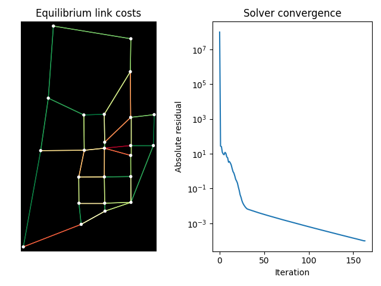

# pytorch-route-choice

PyTorch implementations of route choice models for transportation networks. Sparse operations via [PyTorch Geometric](https://pyg.org/) and implicit differentiation via [torchdeq](https://github.com/locuslab/torchdeq).

## Models

- **RecursiveLogitRouteChoice** (aliased as `MarkovRouteChoice`): link-based network route choice ([Fosgerau et al., 2013](https://pubsonline.informs.org/doi/abs/10.1287/trsc.1120.0443)), also usable for Maximum Entropy IRL ([Ziebart et al., 2008](https://cdn.aaai.org/AAAI/2008/AAAI08-227.pdf)).
- **NestedRecursiveLogitRouteChoice**: nested recursive logit with link-specific scale parameters ([Mai et al., 2015](https://www.sciencedirect.com/science/article/abs/pii/S0191261515000582)).
- **PerturbedUtilityRouteChoice**: perturbed utility route choice ([Fosgerau et al., 2022](https://doi.org/10.1016/j.trb.2022.03.006)).

## Installation

```
pip install git+https://github.com/ben-hudson/pytorch-route-choice
```

## Examples

<figure>

<figcaption>Sioux Falls link costs according to the Markovian Traffic Equilibrium model.</figcaption>
</figure>

| Example | Description |
|---------|-------------|
| [recursive_logit_example.py](examples/recursive_logit_example.py) | Learn edge rewards from sampled paths via maximum likelihood |
| [maxent_irl_example.py](examples/maxent_irl_example.py) | Maximum Entropy IRL by matching observed feature counts |
| [purc_example.py](examples/purc_example.py) | Learn utility rates from observed edge flows |
| [markov_traffic_example.py](examples/markov_traffic_example.py) | Traffic equilibrium on the Sioux Falls network using deep equilibrium models |

## Development

```
pip install -e .
pytest tests
```

## Architecture Notes

- The core computation solves linear fixed-point problems `x = Ax + b` via message passing on sparse graphs, using `torchdeq` for implicit differentiation.
- Graph data uses PyTorch Geometric's `edge_index` (COO format) convention: `[2, num_edges]` tensor.
- `MarkovRouteChoice` is aliased to `RecursiveLogitRouteChoice`
- `RecursiveLogitRouteChoice` requires batch dimensions for inputs (use `.unsqueeze(0)` for single instances).
- `node_dim` is specified as a negative offset (default `-1`) to support batched operations.
